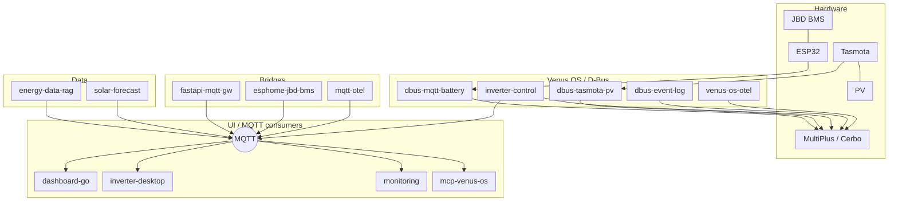

# Hi — Software Engineer & IoT Architect

Low-latency control and monitoring for renewable energy and home automation,
focused on the **Victron Energy** / Venus OS stack: bridges between industrial
hardware, MQTT, D-Bus, and modern dashboards.

Also maintains **[open-ott-play](https://github.com/open-ott-play)** — FOSS IPTV/OTT
player (TypeScript → one ES5 bundle + Rust server).

## Expertise

- **Systems** — Python control loops; Go / Rust services
- **Embedded & IoT** — ESPHome, BLE proxies, MQTT
- **Energy** — ESS / grid-zero, split-phase, battery protection
- **Observability** — live dashboards (Go, Vue, Tauri) + TIG / OpenTelemetry
- **IaC** — GitHub orgs and repos via Terraform

---

## Architecture

Compact stack view (top → bottom). Full repos are linked below.

### Dev & ops

| Repo | Role |
|------|------|
| [integration-tests](https://github.com/victron-venus/integration-tests) | MQTT / battery / PV harness |
| [terraform-github-victron](https://github.com/victron-venus/terraform-github-victron) | IaC for `victron-venus` |
| [terraform-github-4alvit](https://github.com/4alvit/terraform-github-4alvit) | IaC for personal account |
| [iot-project-builder-profile](https://github.com/victron-venus/iot-project-builder-profile) | Profile generator from GitHub activity |

---

## Featured projects

### Control & bridges

| Project | What it does |
|---------|----------------|
| [inverter-control](https://github.com/victron-venus/inverter-control) | ESS grid-zero loop (~3 Hz), EV exclusion, battery protection |
| [dbus-mqtt-battery](https://github.com/victron-venus/dbus-mqtt-battery) + [esphome-jbd-bms-mqtt](https://github.com/victron-venus/esphome-jbd-bms-mqtt) | BLE → MQTT → native Victron batteries |
| [dbus-tasmota-pv](https://github.com/victron-venus/dbus-tasmota-pv) | Tasmota PV → D-Bus |
| [dbus-event-log](https://github.com/victron-venus/dbus-event-log) | D-Bus audit / post-mortem |
| [fastapi-mqtt-gateway](https://github.com/victron-venus/fastapi-mqtt-gateway) | REST/WS → MQTT with auth |

### Monitoring & UI

| Project | What it does |
|---------|----------------|
| [inverter-dashboard-go](https://github.com/victron-venus/inverter-dashboard-go) | Single-binary live dashboard |
| [inverter-dashboard](https://github.com/victron-venus/inverter-dashboard) | FastAPI / Python dashboard |
| [inverter-desktop](https://github.com/victron-venus/inverter-desktop) | Tauri + Rust desktop app |
| [inverter-monitoring](https://github.com/victron-venus/inverter-monitoring) | TIG + Loki stack |
| [venus-os-observability](https://github.com/victron-venus/venus-os-observability) | OTel / Prometheus on D-Bus |
| [mqtt-observability-opentelemetry](https://github.com/victron-venus/mqtt-observability-opentelemetry) | OTel for MQTT IoT |

### Knowledge & agents

| Project | What it does |
|---------|----------------|
| [energy-data-rag-pipeline](https://github.com/victron-venus/energy-data-rag-pipeline) | RAG over Victron docs |
| [solar-forecast-langgraph](https://github.com/4alvit/solar-forecast-langgraph) | Solar forecast via LangGraph |
| [mcp-venus-os](https://github.com/victron-venus/mcp-venus-os) | MCP server for Venus OS |

### Templates & archived

| Project | Notes |
|---------|-------|
| [dbus-service-template](https://github.com/victron-venus/dbus-service-template) | Copier template for D-Bus services |
| [esphome-ble-sensor-patterns](https://github.com/victron-venus/esphome-ble-sensor-patterns) | Production ESPHome BLE patterns |
| [venus-os-governance](https://github.com/victron-venus/venus-os-governance) | Archived — safety moved into inverter-control |

---

## Stack

Python · Go · Rust · TypeScript · Vue · MQTT · Docker · Terraform · Home Assistant · OpenTelemetry

---

## Connect

- GitHub: [@4alvit](https://github.com/4alvit)
- Victron org: [@victron-venus](https://github.com/victron-venus)
- OTT org: [@open-ott-play](https://github.com/open-ott-play)
