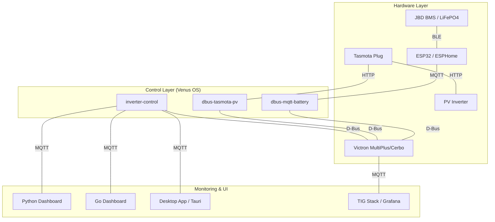

# Hi there! I'm a Software Engineer & IoT Architect 👋

I specialize in building robust, low-latency control systems and monitoring stacks for renewable energy and home automation. My work focuses on the **Victron Energy** ecosystem, where I've developed a comprehensive suite of tools to bridge the gap between industrial energy hardware and modern web/embedded technologies.

## 🚀 Key Expertise

- **Systems Programming:** Real-time control loops in Python and high-performance services in **Go** and **Rust**.
- **Embedded & IoT:** Custom firmware development with **ESPHome**, Bluetooth (BLE) proxying, and MQTT-based messaging.
- **Energy Management:** Advanced ESS (Energy Storage System) logic, split-phase compensation, and grid-zero targeting.
- **Full-Stack Monitoring:** Real-time dashboards (FastAPI, Vue.js, Tauri) and time-series observability (TIG stack).
- **Infrastructure as Code:** Managing complex GitHub organizations and repository configurations via **Terraform**.

---

## 🏗️ System Architecture

My project suite forms a complete ecosystem for home energy management:

---

## 🔋 Featured Projects

### [Inverter Control](https://github.com/victron-venus/inverter-control)
**Advanced ESS Grid-Zero Controller**
- Developed a high-frequency (3Hz) control loop to maintain zero grid feed-in for split-phase systems.
- Implemented complex logic for EV charger exclusion, battery protection, and multi-mode energy strategies.
- **Tech:** Python, D-Bus, Home Assistant API, MQTT.

### [Inverter Dashboard (Go)](https://github.com/victron-venus/inverter-dashboard-go) & [(Python)](https://github.com/victron-venus/inverter-dashboard)
**Real-time Energy Observability**
- Built high-performance monitoring interfaces with WebSocket-based live updates.
- The **Go** version provides a single-binary deployment with sub-10ms latency and minimal memory footprint.
- **Tech:** Go, FastAPI, Vue.js, WebSockets, Docker.

### [Inverter Desktop](https://github.com/victron-venus/inverter-desktop)
**Cross-Platform Monitoring Suite**
- Developed a native desktop application using **Tauri** and **Rust** for low-resource system monitoring.
- Implemented secure MQTT communication with built-in security auditing and fuzz testing (OSS-Fuzz).
- **Tech:** Rust, Tauri, TypeScript, Vite.

### [ESPHome JBD BMS Monitor](https://github.com/victron-venus/esphome-jbd-bms-mqtt) & [dbus-mqtt-battery](https://github.com/victron-venus/dbus-mqtt-battery)
**Embedded Battery Management Bridge**
- Created a robust BLE-to-MQTT proxy to offload unstable Bluetooth connections from the main controller.
- Developed the D-Bus bridge that dynamically registers multiple battery chains as native Victron devices.
- **Tech:** C++ (ESPHome), Python, BLE, MQTT.

### [Terraform GitHub Infrastructure](https://github.com/victron-venus/terraform-github)
**Infrastructure as Code**
- Manages the entire `victron-venus` organization, including 10+ repositories, branch protections, and CI/CD secrets.
- **Tech:** Terraform, GitHub Actions, HCL.

---

## 🛠️ Technical Stack

### Languages & Frameworks

### IoT & Infrastructure

---

## 📈 GitHub Stats

  
   
  

## 📫 Let's Connect
- **GitHub:** [@4alvit](https://github.com/4alvit)
- **Organization:** [@victron-venus](https://github.com/victron-venus)
