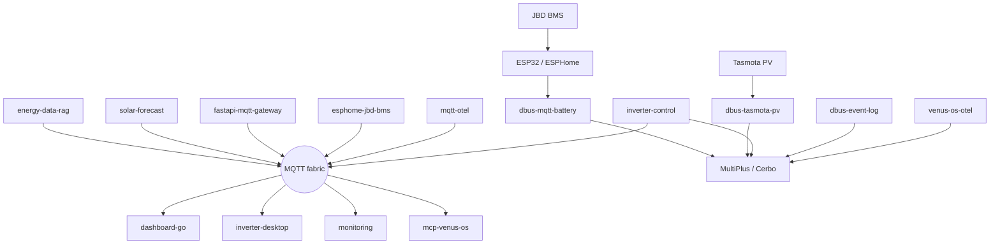

# Hi — Software Engineer & IoT Architect

I build **connectivity fabric** for heterogeneous systems: discovery, routing,
policy, and observability across devices that were never designed to talk to
each other. Day job energy is Victron / Venus OS; the same shape shows up as
service mesh at cloud scale — a paved road so apps (and hardware) do not have
to invent networking themselves.

Two product lines on GitHub: **[victron-venus](https://github.com/victron-venus)**
(energy / Venus OS fabric) and **[open-ott-play](https://github.com/open-ott-play)**
(IPTV/OTT player + Rust edge server).

## Expertise

- **Distributed glue** — MQTT / D-Bus / BLE bridges; gateways; control vs data plane
- **Reliability** — failsafe control loops, audit logs, on-call style ops for home ESS
- **Systems** — Python control; Go / Rust services; ESPHome on the edge
- **Media / edge** — ES5-safe STB UI; Rust reverse-proxy style server for EPG and streams
- **Observability** — live dashboards + TIG / OpenTelemetry across the stack
- **IaC** — GitHub orgs and repos via Terraform

---

## Architecture

One column, top → bottom: producers → fabric → consumers.

**Why this exists:** Venus OS, ESP nodes, and dashboards are different runtimes.
The suite is the mesh between them — injection points (bridges), traffic into a
shared bus (MQTT), locality (on-device D-Bus), policy (inverter-control), and
telemetry (OTel / TIG) — so nothing speaks a private protocol forever.

### Dev & ops

| Repo | Role |
|------|------|
| [integration-tests](https://github.com/victron-venus/integration-tests) | MQTT / battery / PV harness |
| [terraform-github-victron](https://github.com/victron-venus/terraform-github-victron) | IaC for `victron-venus` |
| [terraform-github-4alvit](https://github.com/4alvit/terraform-github-4alvit) | IaC for personal account |
| [iot-project-builder-profile](https://github.com/victron-venus/iot-project-builder-profile) | Profile generator from GitHub activity |

---

## open-ott-play

### [ottplay-foss](https://github.com/open-ott-play/ottplay-foss)

Self-hosted IPTV/OTT player for smart TVs and STBs (MAG, Dune, Tizen, webOS, …)
plus a local Rust HTTP(S) server.

- **Client** — TypeScript → one ES5 classic bundle (`dist/stbPlayer.js`), `window.*` for legacy `prov.js` / device `stb.js`
- **Server** — `ottplay-server` (axum): static files, XMLTV/EPG cache, M3U match, CORS stream proxy, optional TLS
- **Ops** — multi-arch Docker Hub images; local HTTPS stack for day-to-day bring-up
- **Org** — [open-ott-play](https://github.com/open-ott-play) profile + community files

---

## Featured projects (Victron)

### Control & bridges

| Project | What it does |
|---------|----------------|
| [inverter-control](https://github.com/victron-venus/inverter-control) | ESS grid-zero loop (~3 Hz), EV exclusion, battery protection |
| [dbus-mqtt-battery](https://github.com/victron-venus/dbus-mqtt-battery) + [esphome-jbd-bms-mqtt](https://github.com/victron-venus/esphome-jbd-bms-mqtt) | BLE → MQTT → native Victron batteries |
| [dbus-tasmota-pv](https://github.com/victron-venus/dbus-tasmota-pv) | Tasmota PV → D-Bus |
| [dbus-event-log](https://github.com/victron-venus/dbus-event-log) | D-Bus audit / post-mortem |
| [fastapi-mqtt-gateway](https://github.com/victron-venus/fastapi-mqtt-gateway) | REST/WS → MQTT with auth |

### Monitoring & UI

| Project | What it does |
|---------|----------------|
| [inverter-dashboard-go](https://github.com/victron-venus/inverter-dashboard-go) | Single-binary live dashboard |
| [inverter-dashboard](https://github.com/victron-venus/inverter-dashboard) | FastAPI / Python dashboard |
| [inverter-desktop](https://github.com/victron-venus/inverter-desktop) | Tauri + Rust desktop app |
| [inverter-monitoring](https://github.com/victron-venus/inverter-monitoring) | TIG + Loki stack |
| [venus-os-observability](https://github.com/victron-venus/venus-os-observability) | OTel / Prometheus on D-Bus |
| [mqtt-observability-opentelemetry](https://github.com/victron-venus/mqtt-observability-opentelemetry) | OTel for MQTT IoT |

### Knowledge & agents

| Project | What it does |
|---------|----------------|
| [energy-data-rag-pipeline](https://github.com/victron-venus/energy-data-rag-pipeline) | RAG over Victron docs |
| [solar-forecast-langgraph](https://github.com/4alvit/solar-forecast-langgraph) | Solar forecast via LangGraph |
| [mcp-venus-os](https://github.com/victron-venus/mcp-venus-os) | MCP server for Venus OS |

### Templates & archived

| Project | Notes |
|---------|-------|
| [dbus-service-template](https://github.com/victron-venus/dbus-service-template) | Copier template for D-Bus services |
| [esphome-ble-sensor-patterns](https://github.com/victron-venus/esphome-ble-sensor-patterns) | Production ESPHome BLE patterns |
| [venus-os-governance](https://github.com/victron-venus/venus-os-governance) | Archived — safety moved into inverter-control |

---

## Stack

Python · Go · Rust · TypeScript · Vue · MQTT · Docker · Terraform · Home Assistant · OpenTelemetry

---

## Connect

- GitHub: [@4alvit](https://github.com/4alvit)
- Victron org: [@victron-venus](https://github.com/victron-venus)
- OTT org: [@open-ott-play](https://github.com/open-ott-play)
