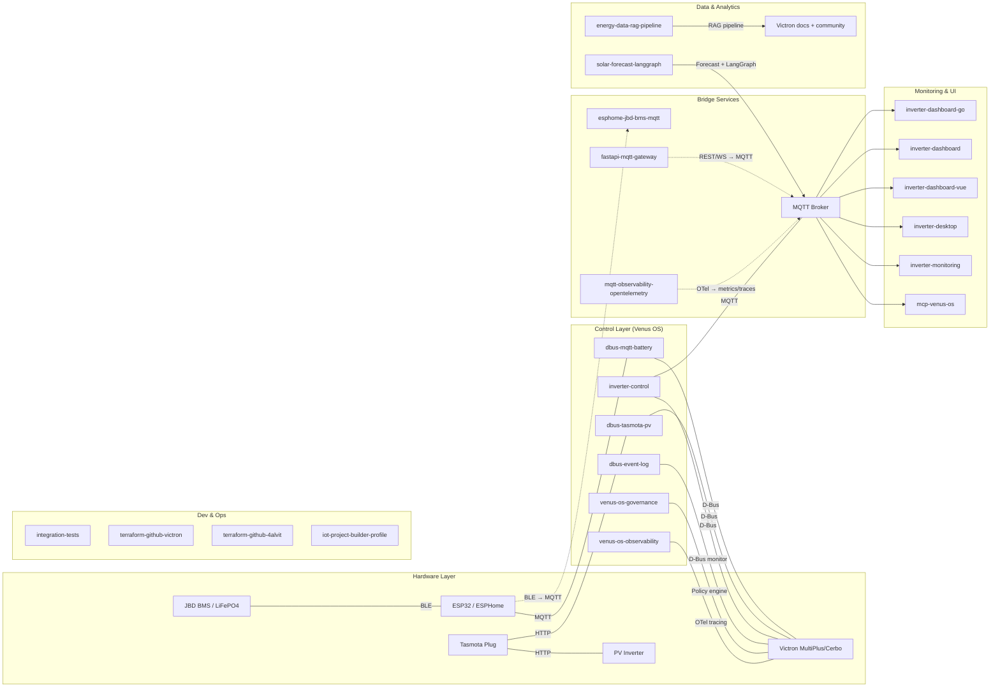

# Hi there! I'm a Software Engineer & IoT Architect 👋

I specialize in building robust, low-latency control systems and monitoring stacks for renewable energy and home automation. My work focuses on the **Victron Energy** ecosystem, where I've developed a comprehensive suite of tools to bridge the gap between industrial energy hardware and modern web/embedded technologies.

## 🚀 Key Expertise

- **Systems Programming:** Real-time control loops in Python and high-performance services in **Go** and **Rust**.
- **Embedded & IoT:** Custom firmware development with **ESPHome**, Bluetooth (BLE) proxying, and MQTT-based messaging.
- **Energy Management:** Advanced ESS (Energy Storage System) logic, split-phase compensation, and grid-zero targeting.
- **Full-Stack Monitoring:** Real-time dashboards (FastAPI, Vue.js, Tauri) and time-series observability (TIG stack).
- **Infrastructure as Code:** Managing complex GitHub organizations and repository configurations via **Terraform**.

---

## 🏗️ System Architecture

My project suite forms a complete ecosystem for home energy management:

---

## 🔋 Featured Projects

### [Inverter Control](https://github.com/victron-venus/inverter-control)
**Advanced ESS Grid-Zero Controller**
- Developed a high-frequency (3Hz) control loop to maintain zero grid feed-in for split-phase systems.
- Implemented complex logic for EV charger exclusion, battery protection, and multi-mode energy strategies.
- **Tech:** Python, D-Bus, Home Assistant API, MQTT.

### [Inverter Dashboard (Go)](https://github.com/victron-venus/inverter-dashboard-go) & [(Python)](https://github.com/victron-venus/inverter-dashboard)
**Real-time Energy Observability**
- Built high-performance monitoring interfaces with WebSocket-based live updates.
- The **Go** version provides a single-binary deployment with sub-10ms latency and minimal memory footprint.
- **Tech:** Go, FastAPI, Vue.js, WebSockets, Docker.

### [Inverter Desktop](https://github.com/victron-venus/inverter-desktop)
**Cross-Platform Monitoring Suite**
- Developed a native desktop application using **Tauri** and **Rust** for low-resource system monitoring.
- Implemented secure MQTT communication with built-in security auditing and fuzz testing (OSS-Fuzz).
- **Tech:** Rust, Tauri, TypeScript, Vite.

### [ESPHome JBD BMS Monitor](https://github.com/victron-venus/esphome-jbd-bms-mqtt) & [dbus-mqtt-battery](https://github.com/victron-venus/dbus-mqtt-battery)
**Embedded Battery Management Bridge**
- Created a robust BLE-to-MQTT proxy to offload unstable Bluetooth connections from the main controller.
- Developed the D-Bus bridge that dynamically registers multiple battery chains as native Victron devices.
- **Tech:** C++ (ESPHome), Python, BLE, MQTT.

### [Inverter Monitoring Stack](https://github.com/victron-venus/inverter-monitoring)
**System Observability & Time-Series Data**
- Deployed a comprehensive **TIG (Telegraf, InfluxDB, Grafana)** stack for long-term telemetry storage and visualization.
- Implemented automated log shipping with Loki and GitHub webhook-based auto-deployment for the monitoring infrastructure.
- **Tech:** Docker, Telegraf, InfluxDB, Grafana, Loki.

### [New: Venus OS Governance](https://github.com/victron-venus/venus-os-governance)
**Policy Engine with Approval Gates**
- Policy engine for Venus OS with SOC limits, charge/discharge rules, inverter control policies.
- Audit logging via dbus-event-log with approval workflows for critical operations.
- **Tech:** Python, D-Bus, MQTT, Policy-as-Code.

### [New: Venus OS Observability](https://github.com/victron-venus/venus-os-observability)
**OpenTelemetry/Prometheus Observability Stack**
- D-Bus event tracing, inverter metrics export, distributed tracing across MQTT → D-Bus → inverter-control pipeline.
- **Tech:** OpenTelemetry, Prometheus, Grafana, D-Bus.

### [New: Energy Data RAG Pipeline](https://github.com/victron-venus/energy-data-rag-pipeline)
**RAG Pipeline for Victron Knowledge**
- Retrieval-Augmented Generation for Victron Energy documentation and community knowledge.
- Built with FastAPI, LangChain, pgvector, and PostgreSQL.
- **Tech:** Python, FastAPI, LangChain, pgvector, PostgreSQL.

### [New: Solar Forecast LangGraph](https://github.com/4alvit/solar-forecast-langgraph)
**Solar Forecasting with LangGraph**
- Advanced solar forecasting using LangGraph for multi-step reasoning and tool use.
- **Tech:** Python, LangGraph, LangChain, FastAPI.

### [New: IoT Project Builder Profile](https://github.com/victron-venus/iot-project-builder-profile)
**Automated Engineering Profile Generator**
- Analyzes GitHub repositories, ESPHome configurations, and D-Bus services to generate comprehensive engineering profiles.
- **Tech:** Python, GitHub API, GraphQL, Jinja2.

### [New: MCP Venus OS](https://github.com/victron-venus/mcp-venus-os)
**MCP Server for Venus OS Management**
- Model Context Protocol server for reading and controlling Venus OS devices via D-Bus and MQTT.
- **Tech:** Python, MCP, D-Bus, MQTT.

### [New: FastAPI MQTT Gateway](https://github.com/victron-venus/fastapi-mqtt-gateway)
**Production-Ready REST/WebSocket → MQTT Bridge**
- Authentication, rate limiting, and real-time streaming capabilities.
- **Tech:** FastAPI, MQTT, WebSockets, JWT.

### [New: MQTT Observability OpenTelemetry](https://github.com/victron-venus/mqtt-observability-opentelemetry)
**Complete Observability Stack for MQTT IoT Systems**
- **Tech:** OpenTelemetry, Prometheus, Grafana, MQTT.

### [New: D-Bus Event Log](https://github.com/victron-venus/dbus-event-log)
**Audit Log for D-Bus Commands & State Transitions**
- Captures all D-Bus signals, method calls, and service lifecycle events on Victron Energy systems.
- Critical for post-mortem analysis of incidents (overloads, battery failures, communication issues).
- **Tech:** Python, D-Bus, SQLite/TimescaleDB, MQTT.

### [New: D-Bus Service Template](https://github.com/victron-venus/dbus-service-template)
**Copier Template for New D-Bus Services**
- Template for generating new D-Bus services with best practices.
- **Tech:** Python, Copier, D-Bus.

### [New: ESPHome BLE Sensor Patterns](https://github.com/victron-venus/esphome-ble-sensor-patterns)
**Reference Library of Production-Ready ESPHome Configurations**
- Extracted from real deployments monitoring 8+ JBD BMS units, Daly BMS, and various temperature/plant sensors.
- **Tech:** ESPHome, C++, YAML, BLE.

### [New: Integration Tests](https://github.com/victron-venus/integration-tests)
**MQTT / Battery / PV Integration Test Harness**
- **Tech:** Python, pytest, MQTT, D-Bus simulation.

### [New: Terraform GitHub Infrastructure](https://github.com/victron-venus/terraform-github-victron)
**Infrastructure as Code for victron-venus Organization**
- Manages the entire `victron-venus` organization, including 20+ repositories, branch protections, and CI/CD secrets.
- **Tech:** Terraform, GitHub Actions, HCL.

---

## 🛠️ Technical Stack

### Languages & Frameworks

### IoT & Infrastructure

---

## 📫 Let's Connect

- **GitHub:** [@4alvit](https://github.com/4alvit)
- **Organization:** [@victron-venus](https://github.com/victron-venus)